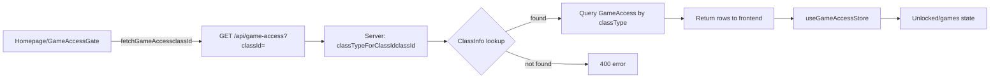
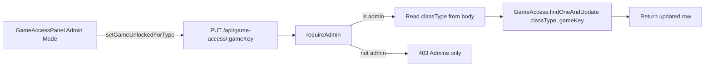
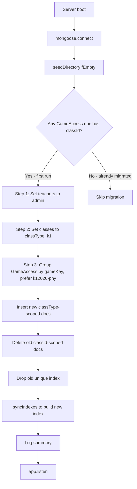
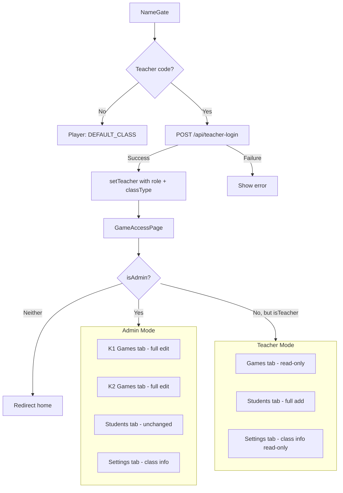

# Class-Type Game Config + Admin Role Overhaul

## Overview

Migrate `GameAccess` scoping from per-`classId` to per-`classType` (`k1`/`k2`). Introduce `admin` role; only admins can edit game config. The read path stays `classId`-keyed (server resolves `classId → classType` internally). Fix the `NameGate` bug where teacher login uses a hardcoded frontend mirror instead of the server API.

---

## Current Codebase State (from code review)

### Frontend (`games/src/`)

| File | Current State | Changes Needed |
|------|--------------|----------------|
| `playerStore.js` | Has `isTeacher`, `teacherCode`, `classId`, `className`, `playerName` | Add `isAdmin: false`, `classType: null`; update `setTeacher()` signature |
| `NameGate.jsx` | `handleCodeSubmit` calls local `lookupTeacher(codeDraft)` from `teacherCodes.js` (line 40) | Rewrite to call `POST /api/teacher-login`; remove `teacherCodes.js` import |
| `teacherCodes.js` | Hardcoded `TEACHER_CODES` object + `lookupTeacher` function | **Delete entire file** (server handles this now) |
| `gameAccess.js` | Has `useGameAccessStore` (classId-scoped READ), plus mutator functions: `setGameUnlocked`, `setGameShiny`, `setGameOrder`, `addGameToClass`, `removeGameFromClass` — all classId-based | Add classType-scoped admin mutators; keep existing read store unchanged |
| `GameAccessPanel.jsx` | Large component (1137 lines). Tabs: `access`, `new`, `students`, `settings`. Full edit controls (drag, lock/unlock, shiny, shop) for teachers | Major restructure: admin gets K1/K2 tabs with full controls; non-admin teacher gets read-only single tab |
| `GameAccessGate.jsx` | ClassId-based read check using `useIsGameUnlocked` | **No changes** — read path stays classId-based |
| `Home.jsx` | Uses `fetchGameAccess(classId)`, `useGameAccessStore` read path | **No changes** — read path unchanged |
| `GameAccessPage.jsx` | Wraps `GameAccessPanel` with `NameGate`, checks `isTeacher` | Minor: also check `isAdmin` to show/hide certain UI in panel |
| `classInfo.js` | `fetchClassInfo(classId)` returns `{classId, className, image, teachers}` | Add `classType` to response (server change) |
| `students.js` | ClassId-scoped, no changes | **No changes** |
| `main.jsx` | Route definitions | **No changes** |

### Server (`server/`) — NOT present in this workspace, separate repo

The server-side models, endpoints, and migration logic are in a separate repository. The plan describes what needs to be done there, but actual implementation will happen in that repo.

---

## Detailed Steps Per Phase

### Phase 1 — Data Model Changes (server repo)

**1a. `models/Teacher.js`** — Add `role` field
```js
role: {
  type: String,
  enum: ['teacher', 'admin'],
  default: 'teacher',
}
```

**1b. `models/ClassInfo.js`** — Add `classType` field
```js
classType: {
  type: String,
  enum: ['k1', 'k2'],
  default: 'k1',
  index: true,
}
```
Also add `classType` to the `GET /api/classes/:classId` response projection.

**1c. `models/GameAccess.js`** — Replace `classId` with `classType`
- Remove `classId` field
- Add `classType: { type: String, required: true, enum: ['k1', 'k2'], index: true }`
- Change compound unique index from `{classId: 1, gameKey: 1}` to `{classType: 1, gameKey: 1}`
- ⚠️ Schema changes alone do NOT migrate existing indexes in MongoDB. The old `{classId:1, gameKey:1}` unique index must be explicitly dropped (handled in Phase 2 migration).

**No changes to:** `models/Student.js`, `models/PlaySession.js`

### Phase 2 — One-time Migration (server repo)

Create `migrateClassTypeAndGameAccess()` called in the `mongoose.connect().then()` chain after `seedDirectoryIfEmpty()` and before `app.listen()`.

**2a. Teachers → admins (idempotent)**
- For teacher codes `'12/10/22'` and `'92702689'`, set `role: 'admin'` IF `role` is missing/undefined
- Guard: `{ code: { $in: ['12/10/22', '92702689'] }, role: { $exists: false } }`
- This avoids clobbering manually-changed roles on re-deploys

**2b. Classes → classType (idempotent)**
- For every `ClassInfo` doc missing `classType`, set `classType: 'k1'`
- Guard: `{ classType: { $exists: false } }`

**2c. GameAccess → classType (idempotent, destructive)**
- Check: if any `GameAccess` doc still has a `classId` field
- Group existing docs by `gameKey`
- For each `gameKey`:
  - Prefer the row from class `'k12026-pny'` as source of truth when both classes have a row for the same key
  - Insert one new doc with `{ classType: 'k1', ...rest }`
- After inserting all: delete old `classId`-scoped docs
- Drop old unique index: `GameAccess.collection.dropIndex('classId_1_gameKey_1')`
- Call `GameAccess.syncIndexes()` to build new `{classType: 1, gameKey: 1}` unique index
- Log summary: `Migrated X GameAccess rows to classType-based scoping, dropped old index`

**2d. Logging**
- Log a one-line summary of each step's counts for Render deploy log sanity check

### Phase 3 — Server Helpers (`directory.js` or server.js)

**3a. `lookupTeacher(code)`** — Update return shape
```js
// Current: { name, classId, className }
// New:     { name, classId, className, classType, role }
```
Resolve `classType` by looking up the teacher's `classId` in `ClassInfo`.

**3b. `classTypeForClassId(classId)`** — New helper
```js
async function classTypeForClassId(classId) {
  const info = await ClassInfo.findOne({ classId });
  return info?.classType || null;
}
```

**3c. `requireAdmin(req, res)`** — New middleware (alongside `requireTeacher`)
```js
async function requireAdmin(req, res) {
  const teacher = await requireTeacher(req, res);
  if (!teacher) return null; // requireTeacher already sent a response
  if (teacher.role !== 'admin') {
    res.status(403).json({ error: 'Admins only' });
    return null;
  }
  return teacher;
}
```

### Phase 4 — Backend Endpoints (server repo, `server.js`)

**4a. `GET /api/game-access?classId=` — READ (change internals only)**
- Resolve `classId → classType` via `classTypeForClassId(classId)`
- Return 400 if unknown classId
- Query `GameAccess.find({ classType })` instead of `{ classId }`
- Response shape to frontend is **unchanged** (frontend doesn't need to know about classType)

**4b. `POST /api/teacher-login` — NEW endpoint (fixes the bug)**
- Request body: `{ code }`
- Call `lookupTeacher(code)`
- If not found: `401 { error: "That code doesn't match..." }`
- If found: `200 { name, classId, className, classType, role }`

**4c. Write endpoints — admin-only + classType-scoped**
For all of:
- `PUT /api/game-access/:gameKey` (set unlocked)
- `PUT /api/game-access/:gameKey/shiny` (set shiny)
- `PUT /api/game-access/order` (reorder)
- `POST /api/game-access/:gameKey` (shop add)
- `DELETE /api/game-access/:gameKey` (shop remove)

Changes:
- Replace `requireTeacher` → `requireAdmin`
- Read `classType` from `req.body.classType` (validate `'k1'` or `'k2'`)
- Change query from `{ classId, gameKey }` to `{ classType, gameKey }`
- Return `403` for non-admins

**4d. `GET /api/classes/:classId`**
- Include `classType` in the response object

**4e. Stretch: `PUT /api/classes/:classId` (admin-only)**
- Allow admin to update `className`, `image`, `classType`
- Optional — defer if time is short

### Phase 5 — Frontend Session/Auth (`games/src/`)

**5a. `playerStore.js`**
```js
// Add to initial state:
isAdmin: false,
classType: null,

// Update setTeacher:
setTeacher: (teacher, code) => {
  set({
    playerName: teacher.name,
    classId: teacher.classId,
    className: teacher.className,
    classType: teacher.classType,     // NEW
    isTeacher: true,
    isAdmin: teacher.role === 'admin', // NEW
    teacherCode: code,
  });
},

// Update resetPlayer to also reset:
isAdmin: false,
classType: null,
```

**5b. `NameGate.jsx` — Convert teacher code submit to API call**
```js
// Remove line 4: import { lookupTeacher } from './teacherCodes';

// Replace handleCodeSubmit (lines 38-48):
const handleCodeSubmit = async (event) => {
  event.preventDefault();
  setCodeError(null);
  setIsSubmitting(true);  // NEW loading state

  try {
    const response = await fetch(`${API_BASE}/api/teacher-login`, {
      method: 'POST',
      headers: { 'Content-Type': 'application/json' },
      body: JSON.stringify({ code: codeDraft.trim() }),
    });
    const data = await response.json();

    if (!response.ok) {
      setCodeError(data.error || "That code doesn't match...");
      return;
    }

    setTeacher(data, codeDraft.trim());
  } catch (err) {
    setCodeError('Could not connect. Please try again.');
  } finally {
    setIsSubmitting(false);
  }
};
```
- Add `API_BASE` constant (import from env or hardcode)
- Add `isSubmitting` state; disable submit button while loading
- Show spinner/loading state on the submit button

**5c. Delete `teacherCodes.js`**
- Remove the file entirely once nothing imports it
- Keep the backend `directory.js` version (real validation lives server-side)

### Phase 6 — Frontend Game-Access Admin Editing (`games/src/`)

**6a. `gameAccess.js` — Add classType-scoped admin functions**

Add these new exports alongside the existing classId-based ones:

```js
// Fetch game access for a specific classType (admin panel use)
export async function fetchGameAccessForType(classType, teacherCode) {
  const response = await fetch(
    `${API_BASE}/api/game-access?classType=${encodeURIComponent(classType)}&teacherCode=${encodeURIComponent(teacherCode)}`
  );
  if (!response.ok) throw new Error('Failed to load game access');
  return response.json();
}

// OR extend GET /api/game-access to accept ?classType= for admins
// (pick whichever is less invasive)
```

Admin mutators (mirror existing ones but keyed by classType):
```js
export async function setGameUnlockedForType(gameKey, unlocked, classType, teacherCode) {
  // PUT /api/game-access/:gameKey with { unlocked, classType, teacherCode }
}

export async function setGameShinyForType(gameKey, shiny, classType, teacherCode) {
  // PUT /api/game-access/:gameKey/shiny with { shiny, classType, teacherCode }
}

export async function setGameOrderForType(gameKeys, classType, teacherCode) {
  // PUT /api/game-access/order with { gameKeys, classType, teacherCode }
}

export async function addGameToType(gameKey, classType, teacherCode) {
  // POST /api/game-access/:gameKey with { classType, teacherCode }
}

export async function removeGameFromType(gameKey, classType, teacherCode) {
  // DELETE /api/game-access/:gameKey with { classType, teacherCode }
}
```

**6b. `GameAccessPanel.jsx` — Major restructure**

The component needs to handle two distinct modes:

**Admin mode** (`isAdmin === true`):
- Tab bar: **"K1 Games"** | **"K2 Games"** | Students | Settings
- "K1 Games" tab: full edit controls (drag-reorder, lock/unlock, shiny, shop add/remove) scoped to `classType: 'k1'`
- "K2 Games" tab: same full edit controls scoped to `classType: 'k2'`
- Default active tab: admin's own `classType` (from `playerStore`)
- Each tab lazily loads its own game access data (only when first opened)
- Both tabs must be **fully functional** — not stubs
- Shop (New Games) should be moved inline or as a section within each tab, OR remain as a separate sub-view within each classType tab

**Teacher mode** (`isTeacher && !isAdmin`):
- Tab bar: **"Games"** | Students | Settings
- "Games" tab: read-only — no drag handles, no lock/shiny toggle buttons, no shop controls
  - Just static badges showing: locked/unlocked status, shiny or not, in current order
- Students tab: works exactly as today (full add-student capability)
- Settings tab: read-only class info (no edit controls)

**Implementation approach for Panel:**
1. Read `isAdmin` and `classType` from `usePlayerStore`
2. Define tabs conditionally based on role
3. For admin: create a `GameAccessTypeTab` sub-component that can be instantiated for both `'k1'` and `'k2'` with the classType passed as a prop — this avoids duplicating the entire game slot UI
4. For teacher: create a `ReadOnlyGameList` sub-component that renders static badges
5. The existing `access` tab's drag/sort/edit logic becomes the admin mode's per-type tab
6. The existing `new` tab's shop logic becomes accessible within each admin type tab

**Detailed tab structure for admin:**
```
Admins see:
  [K1 Games] [K2 Games] [Students] [Settings]

K1 Games tab:
  - Shows GameAccess for classType='k1'
  - Drag-reorder, lock/unlock toggles, shiny toggles
  - "Shop" section to add/remove games for k1
  - Confirm/reset footer (same as current access tab)

K2 Games tab:
  - Shows GameAccess for classType='k2' (may be empty initially)
  - Same controls as K1 tab
  - Shop shows all games; admin can add any to k2

Students tab: unchanged
Settings tab: unchanged (class info)
```

**Detailed tab structure for non-admin teacher:**
```
Teachers see:
  [Games] [Students] [Settings]

Games tab:
  - Shows current classType's game arrangement
  - Read-only list: game name, locked/unlocked badge, shiny badge, order
  - No drag handles, no toggle buttons, no shop
  - No confirm/reset footer

Students tab: unchanged
Settings tab: unchanged (class info)
```

### Phase 7 — Verification Checklist

- [ ] Fresh boot against real data: migration runs once, logs sane summary
- [ ] Running server a second time does nothing (no duplicates, no re-flipping)
- [ ] Legacy teacher code logs in → `isAdmin: true`, `classType: 'k1'`
- [ ] Admin sees K1 Games tab active by default, can reorder/lock/unlock/add-from-shop
- [ ] Admin switches to K2 Games tab → empty state, but all controls work
- [ ] Admin adds game to K2, reorders it, locks/unlocks it → all work
- [ ] Non-admin teacher (role: 'teacher') logs in → read-only panel
- [ ] Non-admin teacher's Games tab shows current state as static badges only
- [ ] Non-admin teacher's Students tab still has working "Add new student"
- [ ] Non-admin teacher gets 403 hitting write endpoints directly
- [ ] Player (name-only login) sees homepage unlocked games correctly
- [ ] Direct URL to locked game shows "not out yet" for players
- [ ] Direct URL to locked game lets teachers/admins through
- [ ] `POST /api/plays` still logs sessions correctly
- [ ] Old `{classId, gameKey}` unique index confirmed gone from MongoDB

### Phase 8 — Rollback Safety

- Before running Phase 2 against production:
  ```bash
  mongodump --db=<dbname> --collection=gameaccesses --out=./backup/
  mongodump --db=<dbname> --collection=teachers --out=./backup/
  mongodump --db=<dbname> --collection=classinfos --out=./backup/
  ```
- The GameAccess migration is destructive (old classId-keyed docs removed)
- Keep the backup until the new deployment is confirmed stable

---

## Architecture Diagrams

### Data Flow: Read Path (unchanged contract)



### Data Flow: Write Path (changed — admin only, classType-scoped)



### Migration Flow



### Frontend Component Tree (after changes)



---

## Key Design Decisions

1. **Read path stays classId-based**: The server resolves `classId → classType` internally. Zero frontend read-path changes. This minimizes risk and testing surface.

2. **Two separate admin tabs (K1/K2) vs. a toggle**: Two top-level tabs ensure both class types are independently editable without losing state when switching. An admin can compare K1 and K2 arrangements side by side.

3. **Teacher panel is read-only**: Non-admin teachers get exactly three capabilities: view class info, add students, view games. No edit controls anywhere.

4. **Existing mutators remain**: The old classId-based `setGameUnlocked` etc. are kept for backward compatibility but will no longer be called from the UI. New classType-scoped functions are added alongside them.

5. **Server not in this workspace**: The server repo is separate. All Phase 1-4 changes go there. This plan documents what needs to be built but the actual code lives in the server repo.

---

## Files to Modify (frontend)

| File | Change Type | Description |
|------|-------------|-------------|
| `src/playerStore.js` | Edit | Add `isAdmin`, `classType`; update `setTeacher` |
| `src/NameGate.jsx` | Edit | Convert to API call; add loading state |
| `src/teacherCodes.js` | Delete | No longer needed |
| `src/gameAccess.js` | Edit | Add classType-scoped admin mutators |
| `src/GameAccessPanel.jsx` | Edit | Major restructure for admin/teacher modes |

## Files to Modify (server — separate repo)

| File | Change Type | Description |
|------|-------------|-------------|
| `models/Teacher.js` | Edit | Add `role` field |
| `models/ClassInfo.js` | Edit | Add `classType` field |
| `models/GameAccess.js` | Edit | Replace `classId` with `classType` |
| `server.js` | Edit | Add migration, new endpoints, update existing ones |
| `directory.js` | Edit | Update helpers, add `requireAdmin`, `classTypeForClassId` |
